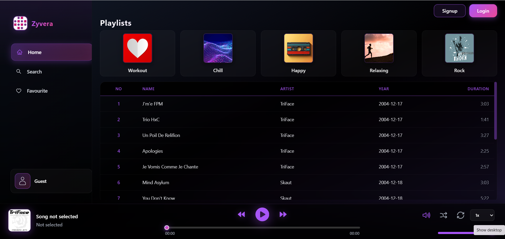
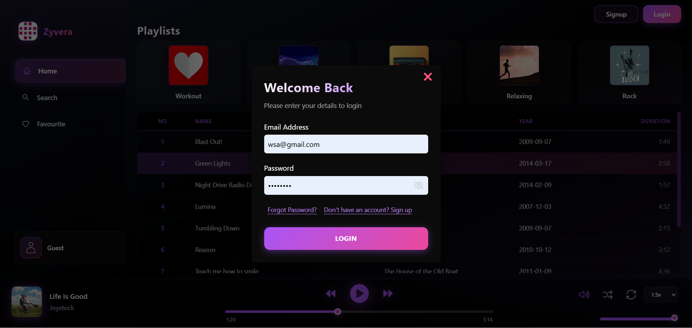
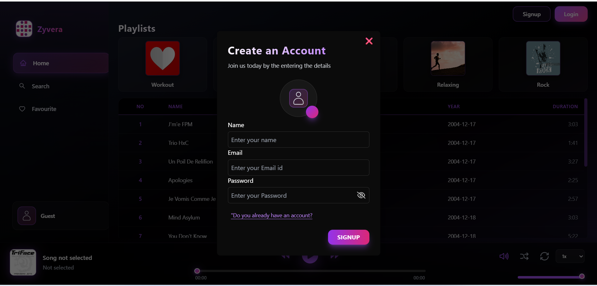
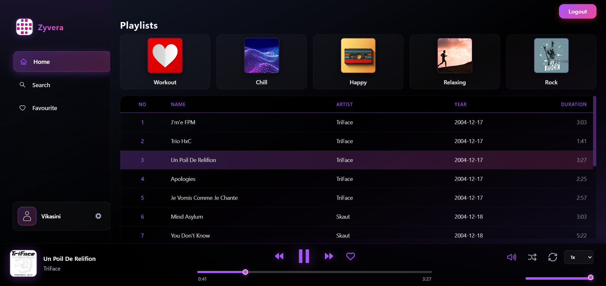
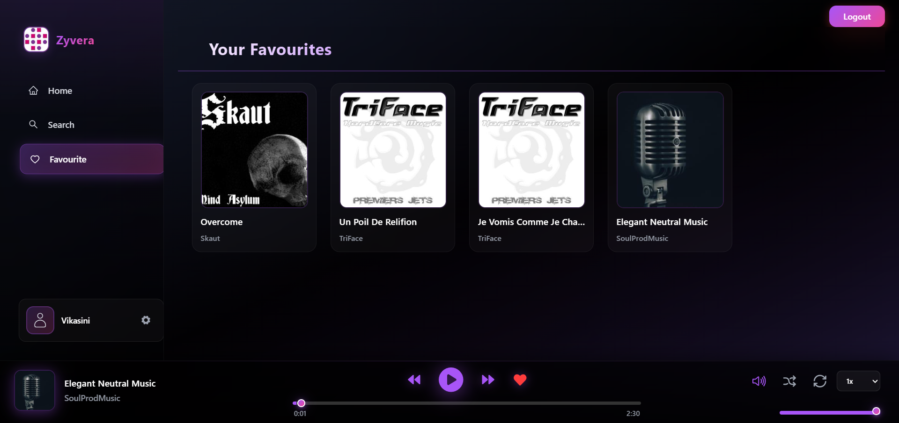
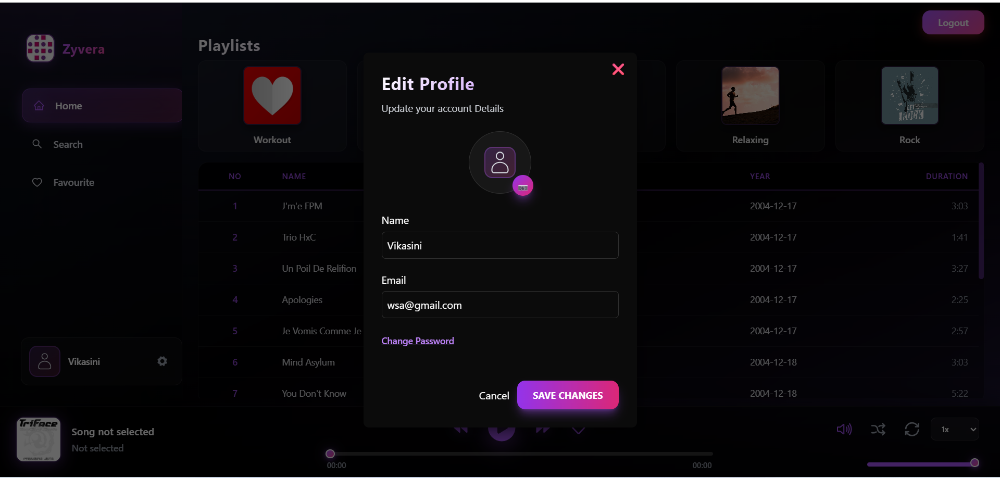
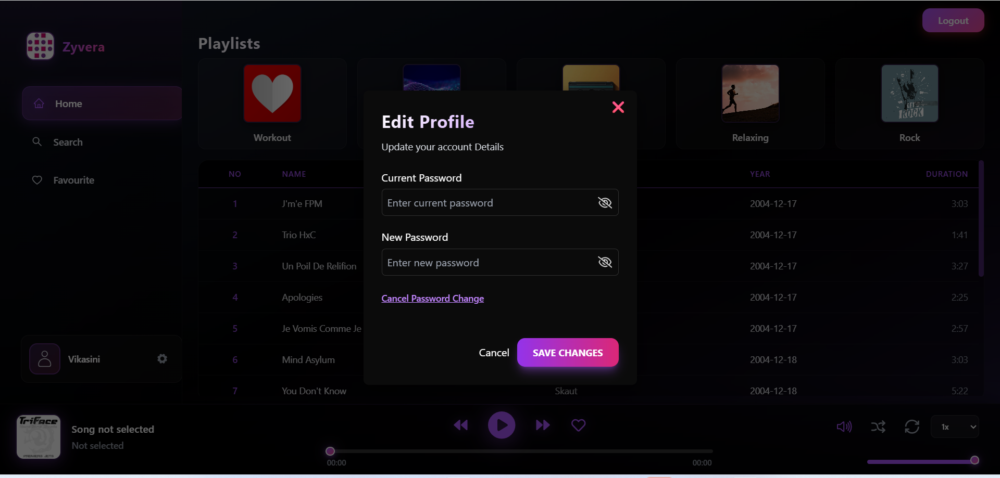

# Zyvera – Full Stack Music Streaming Platform

## Overview

Zyvera is a full-stack music streaming application built using the MERN stack (MongoDB, Express.js, React.js, and Node.js). The platform provides secure user authentication, music browsing, playlist exploration, favorites management, and password recovery functionality through a modern and responsive user interface.

---

## Features

### Authentication & Security

* User Registration
* User Login
* JWT-Based Authentication
* Password Reset via Email
* Secure Password Hashing with Bcrypt
* Protected Routes

### Music Features

* Browse Songs
* Music Playback Controls
* Search Songs
* Favorite Songs Management
* Playlist Browsing

### User Experience

* Responsive User Interface
* Redux Toolkit State Management
* Dynamic Content Rendering
* Clean and Modern Design

---

## Technology Stack

### Frontend

* React.js
* Redux Toolkit
* Axios
* CSS
* Vite

### Backend

* Node.js
* Express.js
* MongoDB
* Mongoose
* JWT Authentication
* Bcrypt.js

### Services & Tools

* Mailtrap
* ImageKit
* Git
* GitHub
* VS Code

---

## Project Structure

```text
fullstack-music-player
│
├── backend
│   ├── config
│   ├── controllers
│   ├── middleware
│   ├── models
│   ├── routes
│   ├── utils
│   └── package.json
│
├── frontend
│   ├── public
│   ├── src
│   │   ├── assets
│   │   ├── components
│   │   ├── redux
│   │   ├── pages
│   │   └── services
│   └── package.json
│
├── screenshots
│   ├── home.png
│   ├── login.png
│   ├── signup.png
│   └── player.png
│
└── README.md
```

---

## Screenshots

### Home Page



### Login Page



### Signup Page



### Music Player



### Favourites



### Edit Profile



### Change Password




---

## Installation

### Clone Repository

```bash
git clone https://github.com/vikasini1711/zyvera.git
```

### Backend Setup

```bash
cd backend
npm install
npm run dev
```

### Frontend Setup

```bash
cd frontend
npm install
npm run dev
```

---

## Environment Variables

Create a `.env` file inside the backend directory.

```env
PORT=5000

MONGODB_URI=YOUR_MONGODB_URI

JWT_SECRET=YOUR_JWT_SECRET

MAILTRAP_HOST=
MAILTRAP_PORT=
MAILTRAP_USER=
MAILTRAP_PASS=

IMAGEKIT_PUBLIC_KEY=
IMAGEKIT_PRIVATE_KEY=
IMAGEKIT_URL_ENDPOINT=
```

---

## Learning Outcomes

This project helped strengthen practical knowledge in:

* Full Stack MERN Development
* RESTful API Design
* Authentication and Authorization
* MongoDB Database Operations
* Redux State Management
* Password Recovery Workflows
* Frontend and Backend Integration
* Version Control with Git and GitHub

---

## Future Enhancements

* Custom Playlist Creation
* Recently Played Songs
* Song Recommendation System
* Theme Customization
* User Listening Analytics
* Social Sharing Features

---

## Developer

**Vikasini S**

Aspiring Software Developer with an interest in Full Stack Development, Problem Solving, and Building Scalable Web Applications.

---

## License

This project is intended for educational and portfolio purposes.
